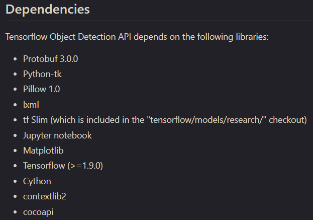

# TensorFlow Object Detection API 사용법

## Step 1. 설치 & Test

1. tensorflow models 를 github에서 받는다.

```bash
$ cd~
$ git clone https://github.com/tensorflow/models
```

python에 tensorflow와 jupyter가 다 깔려있다고 가정하고 진행하겠다.  

tensorflow는 **1.9** 이상이어야 한다.

만약 window에서 git이 깔려있지 않을 경우  https://git-scm.com/download/win 에서 git을 다운받아 설치하자.

그러면 git bash가 깔리는데 본인은 git bash에서 작업하였다.

https://github.com/tensorflow/models/blob/master/research/object_detection/g3doc/installation.md 에 들어가면 install 하는 방법이 나와 있다.

Dependencies를 다 깔아놔야한다.


- ubuntu 14.04
``` bash
$ sudo pip install --user pillow
$ sudo pip install --user lxml
$ sudo pip install --user matplotlib
$ sudo pip install --user Cython
$ sudo pip install --user contextlib2
```

- ubuntu 16.04 이상
``` bash
$ sudo apt-get install protobuf-compiler python-pil python-lxml
$ sudo pip install --user matplotlib
$ sudo pip install --user Cython
$ sudo pip install --user contextlib2
```


- window
``` cmd
pip install pillow
pip install lxml
pip install matplotlib
```
( window는 sudo 명령어가 안먹힐것이다. 만약 sudo를 하고 싶다면 프로그램을 킬때 '관리자 권한으로 실행'을 하자 )

Proto compilation은 https://github.com/google/protobuf/releases 에 들어가서 자신에 맞는 환경의 파일을 다운받는다.

본인은 protoc-3.4.0-linux-x86-64.zip 을 다운 받았다.

``` bash
$ unzip protoc-3.4.0-linux-x86-64.zip
```
압축을 풀면 bin, include 폴더 2개가 나온다.

이것을 그냥 두지말고 하나의 폴더에 묶어두는게 나중에 파일 정리할때도 보기 좋다.

``` bash
$ mkdir ~/protoc
$ mv bin include ~/protoc
```

installation - Protoc compilation 부분에서 From tensorflow/models/research 에서 protoc 관련 명령어를 치라고 나와 있다.

직접 해보면 안된다.

이렇게 명령어를 쳐야 가능하다.

protoc 명령어를 그냥 치면 안되고 protoc 이 있는 경로와 마지막에 protoc을 써 줘야한다.

밑에 예시가 있다.

``` bash
$ ./~/protoc/bin/protoc object_detection/protos/*.proto --python_out=.
```

즉, protoc 받은 폴더안에 bin/protoc을 실행해야 한다.

Pythonpath를 지정하자.

``` bash
$ cd ~/models/research
$ export PYTHONPATH=$PYTHONPATH:'pwd':'pwd'/slim

# 매 터미널마다 이것을 해 줘야 한다. 이게 싫다면 .bashrc에 저장을 해 놓으면 된다

$ gedit ~/.bashrc
( 맨 아랫줄에 추가 )
export PYTHONPATH=$PYTHONPATH:~/models/research:~/models/research/slim
```
window에서는 환경설정을 따로 해줘야한다.

'내컴퓨터' 오른쪽클릭 -> '속성' 클릭 -> 왼쪽탭에 '고급 시스템 설정' 클릭 -> 위 '고급' 탭 클릭 -> 아래에 '환경변수' 클릭 ->
아래쪽 '시스템 변수' 에서 '새로 만들기' 클릭 -> 변수 이름 : PYTHONPATH, 변수 값: ~/model/research/slim;~/model/research ->
'확인'
( 변수 값에 ~ 는 각자 경로를 적어주세요. 그리고 변수값이 2개 들어가야 합니다. research/slim 과 그냥 research )

테스트를 해보자

``` bash
$ cd ~/models/research/object_detection
$ jupyter notebook
```

object_detection_tutorial.ipynb 를 클릭 후 모든 셀을 실행하면 결과 사진이 나온다.

( 실행은 위에 재생 버튼을 누르시거나, 위 탭에 Cell --> Run All 을 누르세요 )

아래 사진이 나온다면 설치 성공!



