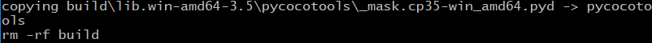

# TensorFlow Object Detection API 사용법


## Step 1 설치 및 test

window

먼저 tensorflow models 를 github에서 받는다.

링크는 [https://github.com/tensorflow/models](https://github.com/tensorflow/models)

아래 사진과 같이 오른쪽에 초록색 버튼을 눌러 Download ZIP를 한다.


models-master.zip 이름으로 받아질텐데 models.zip 로 이름을 바꾸자


[https://github.com/tensorflow/models/blob/master/research/object_detection/g3doc/installation.md](https://github.com/tensorflow/models/blob/master/research/object_detection/g3doc/installation.md)
에 들어가면 install 하는 방법이 나와 있다.

Dependencies를 다 깔아야 한다. ( 밑에 사진 참고 )


cmd 창을 키고 아래와 같이 쳐 준다. cmd는 윈도우키 + R 을 누른 후, cmd 를 치고 엔터를 누르자

``` cmd
> pip install --user pillow
> pip install --user lxml
> pip install --user matplotlib
> pip install --user Cython
> pip install --user contextlib2
```

( window는 sudo 명령어가 안먹힐것이다. 만약 sudo를 하고 싶다면 프로그램을 킬때 '관리자 권한으로 실행'을 하자 )

**Protobuf 설치**

proto compilation은 [https://github.com/google/protobuf/releases](https://github.com/google/protobuf/releases) 에 들어가서 자신에 맞는 환경의 파일을 다운받는다.

본인은 protoc-3.4.0-win32.zip 을 다운 받았다. (3.5를 사용할 경우 문제가 생길 수 있음.)

압축을 풀면 bin, include 폴더 2개가 나온다.

그리고 환경설정에 path를 추가해주자. window에서는 환경설정을 따로 해줘야한다.

'내컴퓨터' 오른쪽클릭 -> '속성' 클릭 -> 왼쪽탭에 '고급 시스템 설정' 클릭 -> 위 '고급' 탭 클릭 -> 아래에 '환경변수' 클릭 ->
'환경변수' 창 아래쪽 '시스템 변수' 에서 'path' 클릭 -> 아래 '편집' 클릭 -> '환경 변수 편집'창 오른쪽 '새로 만들기' 클릭 ->
[자신이 proto 파일 받고 압축 푼 경로]\bin ( 본인은 D:\Jeongho\util\protoc\bin ) -> '확인' 클릭 -> 완료


윈도우에서 환경 설정에 path를 추가하는 방법은 위와 같으니 꼭 알아두자.

커맨드 창에서 models\research 폴더로 들어간 후 아래 protoc 명령어를 넣자

``` cmd
> cd models\research
> protoc object_detection\protos\*.proto --python_out=.
```

**cocoapi 설치**

우선 cocoapi 를 설치하기 전, window 에서 make를 할 수 있는 툴을 설치해야 한다.

우리는 gnuwin32를 설치할 것이다.

[http://gnuwin32.sourceforge.net/downlinks/make.php](http://gnuwin32.sourceforge.net/downlinks/make.php)

[http://gnuwin32.sourceforge.net/downlinks/make-src.php](http://gnuwin32.sourceforge.net/downlinks/make-src.php)

위 두 링크를 통해 설치파일을 다운받고 설치하자.

그리고 환경설정에 path를 추가해주자. window에서는 환경설정을 따로 해줘야한다.

'내컴퓨터' 오른쪽클릭 -> '속성' 클릭 -> 왼쪽탭에 '고급 시스템 설정' 클릭 -> 위 '고급' 탭 클릭 -> 아래에 '환경변수' 클릭 ->
'환경변수' 창 아래쪽 '시스템 변수' 에서 'path' 클릭 -> 아래 '편집' 클릭 -> '환경 변수 편집'창 오른쪽 '새로 만들기' 클릭 ->
C:\Program Files (x86)\GnuWin32\bin -> '확인' 클릭 -> 완료

이렇게 하면 gnuwin32 는 끝났다. cocoapi를 설치해 보자.

[https://github.com/cocodataset/cocoapi](https://github.com/cocodataset/cocoapi) 이 링크로 들어가 아까처럼 다운받고 이름 뒤에 '-master'를 지우고 저장, 압축 풀기
cmd 창에서 cocoapi\PythonAPI 폴더로 들어간 후 빌드를 해 주는게 맞는데... 그대로 하면 에러가 뜬다.


이 에러가 뜨면 C:\Program Files(x86)\Windows Kits\8.1\bin\x86 에서 rc.exe 와 rcdll.dll 2개의 파일을
C:\Program Files(x86)\Microsoft Visual Studio 14.0\VC\bin 에 복사

그리고 cocoapi\PythonAPI 폴더에 들어가면 setup.py 파일이 있는데,  
**12 line** *extra_compile_args =['-Wno-cpp', '-Wno-unused-function', '-std=c99']*, 를 주석처리 ( 이 줄 맨 앞에 # 를 추가하거나 라인 전체를 지우면 된다)  
바로 밑에 *extra_compile_args=['std=c99']* 를 추가해 주면 된다.  
cmd, 커맨드 창에서

``` cmd
> cd cocoapi\PythonAPI
> make
```



가 뜨면 완료!


이런 에러가 뜨면 맨 위에 C:\msys64\usr\bin\make.exe 에서 msys64에 대한 path가 추가되어 있을 수 있다.

path에서 msys64 관련 경로를 지워보자.

이후 cocoapi\PythonAPI 폴더 안에 생긴 pycocotools 폴더를 \models\research\ 로 복사.

여기까지 하면 dependencies를 모두 설치 완료!

이제 라이브러리를 추가해보자.

'내컴퓨터' 오른쪽클릭 -> '속성' 클릭 -> 왼쪽탭에 '고급 시스템 설정' 클릭 -> 위 '고급' 탭 클릭 -> 아래에 '환경변수' 클릭 ->
'환경변수' 창 아래쪽 '시스템 변수' 에서 '새로 만들기' 클릭 -> 변수 이름 : PYTHONPATH -> 변수 값 : [자신이 models 다운받은 경로]\models\research;[자신이 models 다운받은 경로]\models\research\slim -> '확인' -> 완료

설치가 완료되었으므로 test를 해보자.

``` cmd
> cd models\research
> python object_detection\builders\model_builder_test.py
```

아무 에러도 안뜨면 성공~!
