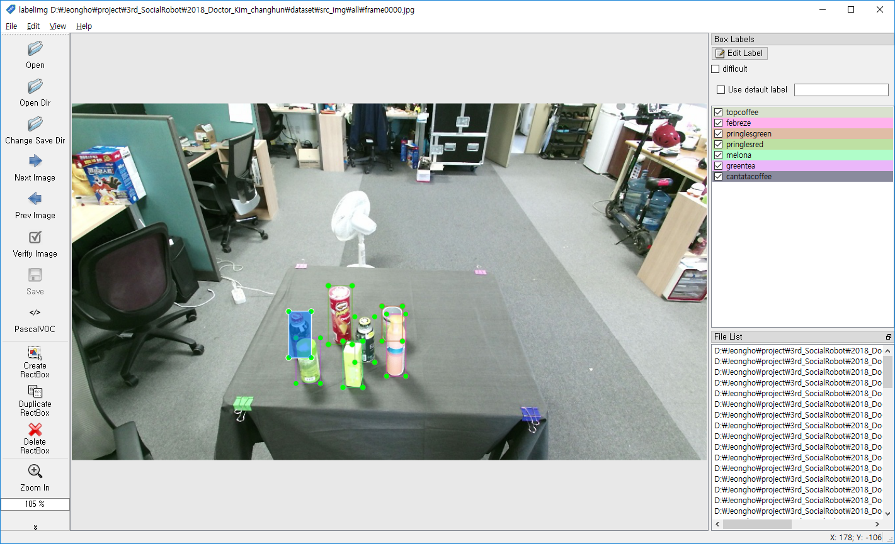
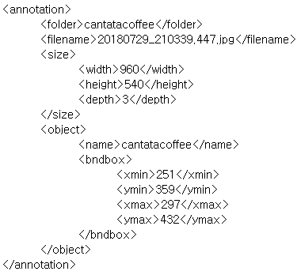

# TensorFlow Object Detection API 사용법

## Step 2 image 모으기

이건 각자 필요한 image를 모으면 된다. 본인은 Imagenet 에서 받은 dataset으로 training을 하였다.

**image file의 확장자는 통일할 것!**(이유는 다음 문서에..)

본인은 jpg로 통일하였다.

## Step 3 각각 Image의 ground truth (bounding box) 만들고 xml로 저장하기

xml 파일을 만들어 bounding box 의 xmin, xmax, ymin, ymax 와 class, directory 등을 넣어주어야 한다.

xml파일이 길지 않다면 fopen, fclose를 써서 만들어도 상관없다.

만약 길다면 opencv에서 filestorage 클래스를 써서 사용하면 된다. ( 본인은 하다가 중간에 문제가 있어서 .. 그냥 fopen 사용했다 )

본인은 https://github.com/tzutalin/labelImg 에서 다운받아 사용했다.

사용법은 간단하며 왼쪽 상단에서 8번째 줄에 PascalVOC 로 선택한 후 xml 를 저장하면 된다.

xml 파일 형식은 위 그림과 같다.

folder와 filename, size, object 저 안에 들어가는 정보는 꼭 필요하다.

image 와 xml 을 각 클래스마다 분류한 후, 각 클래스의 10%는 test 폴더에, 나머지 90%는 train 폴더에 넣어 놓자.

image 와 그 정보를 갖고 있는 xml 파일은 같이 test나 train 폴더에 넣어 놓자.

------------------- 파일 및 폴더 상태 --------------------
( + 폴더, - 파일 )

    + obj_recog
            + images
                    + train
                            - train_images
                            - train_xmls
                    + test
                            - test_images
                            - test_xmls
--------------------------------------------------------------

## Step 4 각 image마다 xml 파일이 있는데 이 파일들을 csv 확장자로 바꿔주기 ( 여러 xml 파일 -> 1개 csv 파일 )

각 image마다 파일 이름이나 bounding box, size 등 정보가 각각 다르다.

위 단계에서 이러한 정보들을 1개의 image마다 1개의 xml 파일로 바꿨다.

xml 파일들을 이제 csv 파일로 전환해보자 ( 多 --> 1 )

xml_to_csv.py 파일을 obj_recog 폴더에 다운 받은 후 실행하자.

완료가 되면 data 폴더에 train_labels.csv 와 test_labels.csv 파일 2개가 생성된다.

----------------------- 파일 및 폴더 상태 -------------------------
( + 폴더, - 파일 )
    + obj_recog
            + data
                    - train_labels.csv
                    - test_labels.csv
            + images
                    + train
                            - train_images
                            - train_xmls
                    + test
                            - test_images
                            - test_xmls
            - xml_to_csv.py
-----------------------------------------------------------------------
