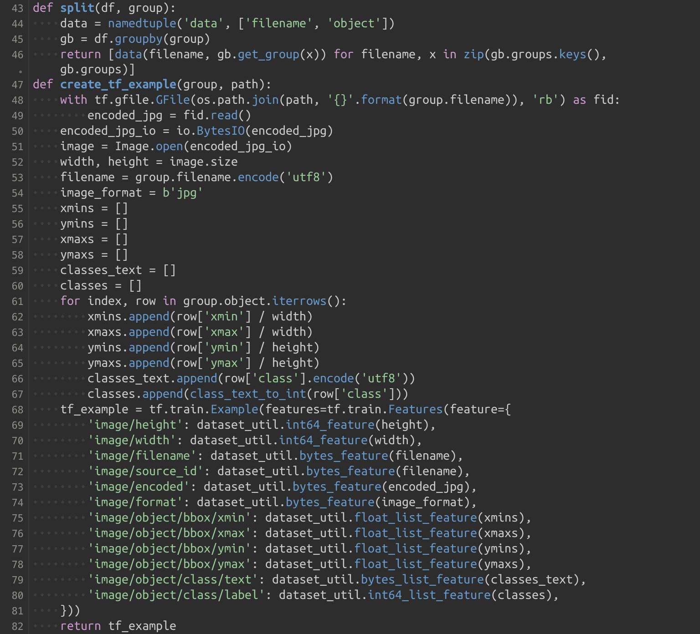
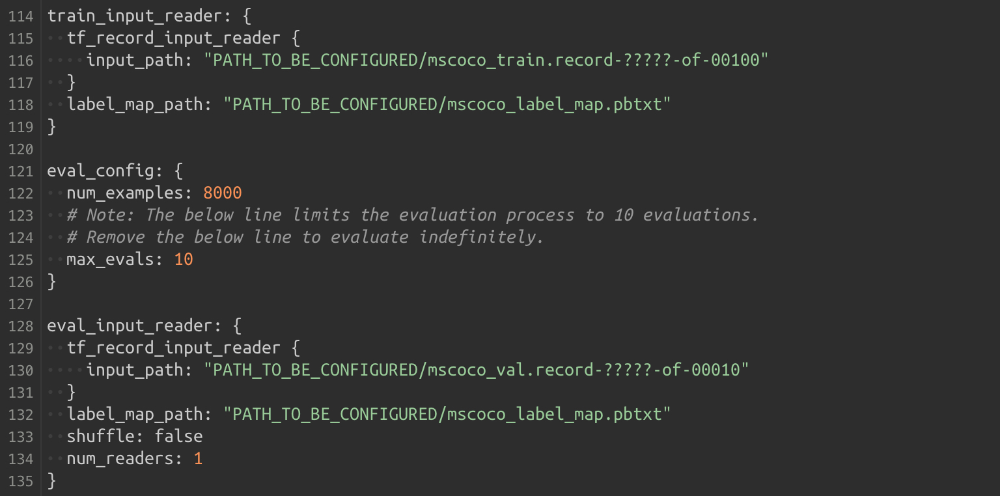

# TensorFlow Object Detection API 사용법


## Step 5 csv 파일과 image들을 사용하여 record 확장자로 변환하기

1개의 record 파일에는 1개 csv 파일과 여러 image에 대한 정보가 담겨있다.

generate_tfrecord.py 파일을 다운 받는다.

맨 위에 보면 사용방법이 나와있다.


**22 line** 과 **23 line**을 보면 csv_input 과 output_path 를 적어주는 것을 볼 수 있다.

이것은 파일 실행시 cmd에서 적어준다.

**27 line** 에서 class 를 적어준다.

xml 파일에 class ( object - name ) 를 적을 때 그 단어를 그대로 적어야 한다.
``` python3
if row_label == 'cracker':
    return 1
elif row_label =='cup':
    reuturn 2
...
```

등으로 한다.

이것은 자신의 custom class 숫자에 맞게  수정하면 된다.




**54 line** create_tf_example 함수를 보면  **jpg의 image** 파일을 불러오는 것을 확인할 수 있다.


**85 line** main 함수에서  **87 line** 을 보면 images/test 혹은 images/train 을 볼 수 있는데 train 폴더에서 record 파일을 뽑을때는 train으로 맞춰주고 test에서도 똑같이 한다.

**87 line** path = os.path.join(os.getcwd(), '경로') 에서 뒤에 '경로'를 'images/train'로 수정 후

``` bash
$ python3 generate_tfrecord.py --csv_input=data/train_labels.csv --output_path=data/train.record
```

**87 line** path = os.path.join(os.getcwd(), '경로') 에서 뒤에 '경로'를 'images/test'로 수정 후

``` bash
$ python3 generate_tfrecord.py --csv_input=data/test_labels.csv --output_path=data/test.record
```

----------------------- 파일 및 폴더 상태 -------------------------
( + 폴더, - 파일 )
    + obj_recog
            + data
                    - train_labels.csv
                    - test_labels.csv
                    - train.record
                    - test.record
            + images
                    + train
                            - train_images
                            - train_xmls
                    + test
                            - test_images
                            - test_xmls
            - xml_to_csv.py
            - generate_tfrecord.py
-----------------------------------------------------------------------


## Step 6 자신이 사용할 model과 config 파일을 다운받고 수정하기

config 파일에는 model의 hyper-parameter, training_step, training 에 사용할 data 경로 등에 대한 정보가 있다.

이를 수정하여 사용하면 된다.

일단 자신이 training 할 모델을 선택한다.

[https://github.com/tensorflow/models/blob/master/research/object_detection/g3doc/detection_model_zoo.md](https://github.com/tensorflow/models/blob/master/research/object_detection/g3doc/detection_model_zoo.md)

위 깃헙을 들어가면 ssd, faster rcnn 등 여러 detector 와 coco, kitti 등으로 학습한 pretrained model을 다운 받을 수 있다.

본인은 faster_rcnn_resnet101_coco_2018_01_28.tar.gz 를 다운 받았다.

[https://github.com/tensorflow/models/tree/master/research/object_detection/samples/configs](https://github.com/tensorflow/models/tree/master/research/object_detection/samples/configs)

위 깃헙에는 다운 받을 수 있는 model_zoo 의 config 파일 sample을 다운받을 수 있다.

본인은 faster_rcnn_resnet101_coco_2018_01_28.config를 다운 받았다. 이것을 수정해서 training에 써보자.

config 파일을 살펴보자.


**4 line** PATH_TO_BE_CONFIGURED 를 검색해서 반드시 수정하라고 한다.

**9 line** num_classes: 가 적혀 있는데 자신에 맞는 class 숫자를 적어주면 될 것 같다.


**85 line** batch_size 는 default 로 1로 되어 있다. ( SSD인 경우 24 )

**106 line** fine_tune_checkpoint: 자신이 사용할 pretrained_model의 ckpt 파일을 가져오면 된다.  
(본인은 "faster_rcnn_resnet101_coco_2018_01_28/model.ckpt")



**116 line** input_path: 자신의 train.record 경로를 적어주면 된다. (본인은 data/train.record)

**118 line** label_map_path: pbtxt 경로를 적어주면 되는데 일단. (본인은 data/object-detection.pbtxt)

**130 line** 마찬가지로 input_path: "data/test.record"

**132 line** label_map_path: "data/object-detection.pbtxt"

를 적어주고 저장하자.


----------------------- 파일 및 폴더 상태 -------------------------
( + 폴더, - 파일 )
    + obj_recog
            + data
                    - train_labels.csv
                    - test_labels.csv
                    - train.record
                    - test.record
            + images
                    + train
                            - train_images
                            - train_xmls
                    + test
                            - test_images
                            - test_xmls
            - xml_to_csv.py
            - generate_tfrecord.py
            - faster_rcnn_resnet101_coco_2018_01_28.config
            - faster_rcnn_resnet101_coco_2018_01_28.tar.gz
-----------------------------------------------------------------------

## Step 7 pbtxt 확장자 파일 만들기 ( 각 image의 이름 및 class 정해주기 )

pbtxt 는 class의 이름과 id 등을 기입하는 파일이다.


위 그림과 같이 기입한다.

name은 class name 이고 display_name은 test 시 나오는 이름이다.

파일 이름은 data/object-detection.pbtxt

 data 폴더 안에 저장.

----------------------- 파일 및 폴더 상태 -------------------------
( + 폴더, - 파일 )
    + obj_recog
            + data
                    - train_labels.csv
                    - test_labels.csv
                    - train.record
                    - test.record
                    - object-detection.pbtxt
            + images
                    + train
                            - train_images
                            - train_xmls
                    + test
                            - test_images
                            - test_xmls
            - xml_to_csv.py
            - generate_tfrecord.py
            - faster_rcnn_resnet101_coco_2018_01_28.config
            - faster_rcnn_resnet101_coco_2018_01_28.tar
-------------------------------------------------------------------------
