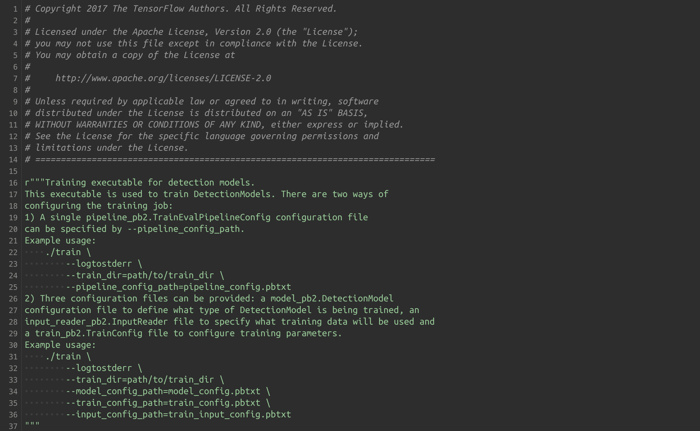

# TensorFlow Object Detection API 사용법


## Step 8 train 및 tensorboard 사용방법

----------------------- 파일 및 폴더 상태 -------------------------
( + 폴더, - 파일 )
    + obj_recog
            + training
                    + data
                            - train_labels.csv
                            - test_labels.csv
                            - train.record
                            - test.record
                            - object-detection.pbtxt
                    - faster_rcnn_resnet101_coco_2018_01_28.config
                    - faster_rcnn_resnet101_coco_2018_01_28.tar
            + images
                    + train
                            - train_images
                            - train_xmls
                    + test
                            - test_images
                            - test_xmls
            - xml_to_csv.py
            - generate_tfrecord.py

-------------------------------------------------------------------------

이 폴더들을 옮기자.

obj_recog 폴더 안에 있는 data 폴더, faster_rcnn_resnet101_coco_2018_01_28.config, faster_rcnn_resnet101_coco_2018_01_28.tar.gz 를 \models\research\object_detection\ 폴더에 옮기자.

----------------------- 파일 및 폴더 상태 -------------------------
( + 폴더, - 파일 )

    + models
        + research
            + object_detection
                + training
                    + data
                        - train.record
                        - test.record
                        - object-detection.pbtxt
                    - faster_rcnn_resnet101_coco_2018_01_28.config
                    - faster_rcnn_resnet101_coco_2018_01_28.tar.gz
-------------------------------------------------------------------------

옮긴 후 faster_rcnn_resnet101_coco_2018_01_28.tar.gz 는 압축 풀어 놓는다.

이제 training을 해주는 train.py 파일을 살펴보자



위 부분에 사용방법이 적혀 있다.

그 중 1번을 사용할 것이다.

**27 line** train_dir 는 train directory를 적어주면 된다.

본인은 train directory를 따로 만들어주었다.

**28 line** config_path는 말 그대로 config_path 를 적어주면 된다. ( .pbtxt가 아니라 .config 이다.)

아래 명령어는 \models\research\object_detection\training 경로에서 cmd 창을 통해 실행하자

``` cmd
python ..\legacy\train.py --logtostderr --train_dir=.\save_model --pipeline_config_path=.\faster_rcnn_resnet101_coco_2018_01_28.config
```

그럼 training이 진행될 것이다.

이 때 loss 가 줄어드는 모습등 현재 상황을 보고 싶다면 tensorboard를 사용하면 된다.

``` cmd
> cd ~/model/research/object_detection
> tensorboard --logdir=./training/save_model
```

을 하면 주소를 띄워주는데 거기에 접속하면 된다. 본인은 http://localhost:6006 을 띄워주었다.

접속하면 2분마다 update가 된다.

weight나 bias 등 그래프로 확인할 수 있어서 좋다.

tensorboard를 너무 오래 띄워놓고 training을 진행하면 train이 느려진다.

그래서 확인할 때만 확인하고 별일 없을때는 꺼두자.
